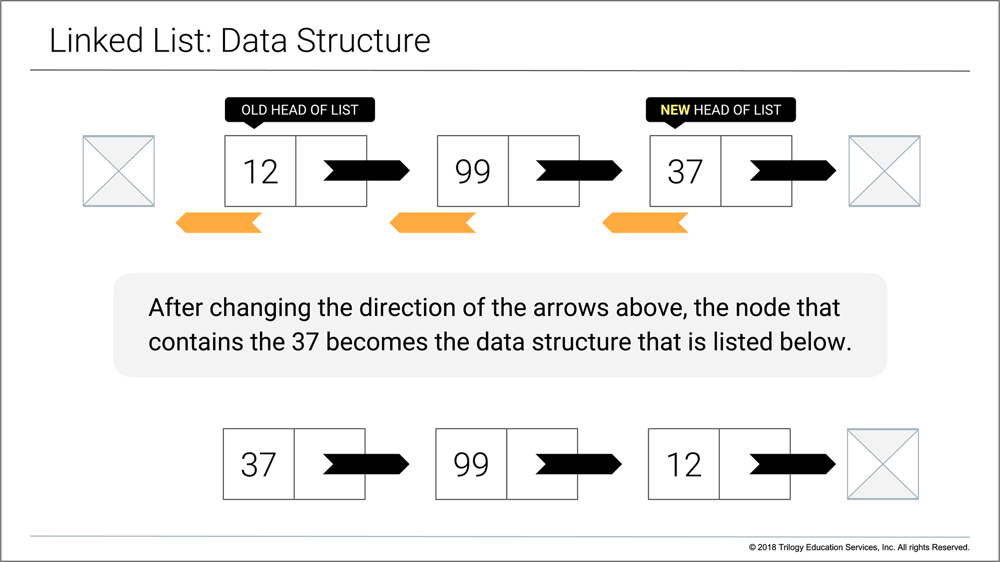

# Reversing a Linked List Using Mutation

***Data Structures-Linked List #2***

## Using Mutation

In this exercise I’ll change the existing LinkedList by going through the list adjusting the `next_node` to point to the previous node.

Another way to think about the problem is to change the direction the arrows point on the items you currently have.

Take this example of a LinkedList again as a starting point.
In this challenge, I’ll reverse the linked list using mutation to modify the initial list that is provided.


Using the example list above I’ll adjust the node with a value of **12** to have the `next_node` of `nil`, then change the element with a value of **99** to have the `next_node` be the element with the value of **12**, finally modify the element with the value of **37** to have the `next_node` be the item with the value of **99**.

Here is a visual representation of how the linked list would look after the mutation.



## Requirements

* The method will change the value of the nex_node as it traverses the list.
* I can't use a Stack as I did in my prior [Linked-List-1](https://github.com/superboss74/Linked-List-1) challenge to implement a solution.

## How to Use

***This was tested using Ruby version - 2.5.3p105.***

1. Clone this repository or download a zip of it.
2. CD into the directory holding the `linked_list_mutation.rb`
3. run the following command from your terminal

```ruby
ruby linked_list_mutation.rb
```

## Bonus Assignment

As an extra assignment, I was asked to create a method that returns `true` if the `LinkedList` is an infinite `LinkedList`(it never ends), or false if it ends.

```ruby
class LinkedListNode
  attr_accessor :value, :next_node

  def initialize(value, next_node=nil)
    @value = value
    @next_node = next_node
  end
end

def print_values(list_node)
  if list_node
    print "#{list_node.value} --> "
    print_values(list_node.next_node)
  else
    print "nil\n"
    return
  end
end

node1 = LinkedListNode.new(37)
node2 = LinkedListNode.new(99, node1)
node3 = LinkedListNode.new(12, node2)
node1.next_node = node3

print_values(node3)
```

Notice how that builds an infinite LinkedList, and after displaying the results for a while it raises an error about the SystemStack.

## Bonus Assignment Solutions

1. CD into the directory holding the `ruby linked_list_3.rb`
2. run the following command from your terminal

```ruby
ruby linked_list_3.rb
```

## Credits

* [The tortoise and the hare - Cycle detection with the help of Aesop’s fables](https://mitchellkember.com/blog/post/tortoise-and-hare/)
* [Detecting a Loop in Singly Linked List - Tortoise & Hare](https://codingfreak.blogspot.com/2012/09/detecting-loop-in-singly-linked-list_22.html)
* [Wikipedia - Cycle detection, Floyd's Tortoise and Hare](https://en.wikipedia.org/wiki/Cycle_detection#Floyd.27s_Tortoise_and_Hare)
* [Wikipedia - Cycle (graph theory) - Cycle Detection](https://en.wikipedia.org/wiki/Cycle_(graph_theory)#Cycle_detection)
